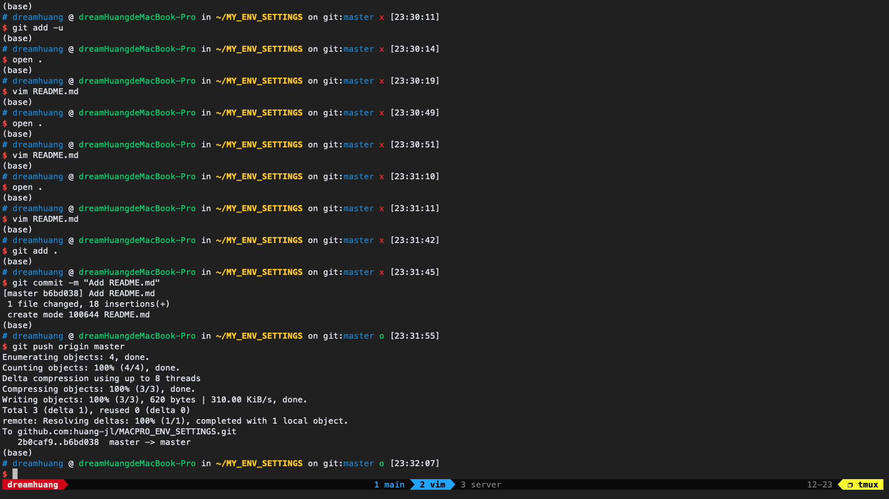
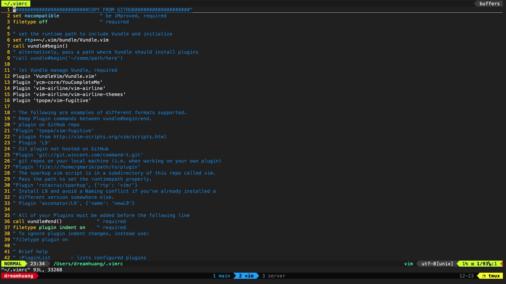

# macOS Settings backend

This repo contains my own settings for macOS Mojave 10.14.6.

Settins include:

- vim
- tmux
- zsh

## Dependency
Tmux config is based on [Oh My Tmux](https://github.com/gpakosz/.tmux) project.

Zsh is based on [Oh My Zsh](https://ohmyz.sh/).

Vim needs macvim with plugin manager [Vundle](https://github.com/VundleVim/Vundle.vim) instead of the origin vim on mac, which can be installed by `brew install macvim`.

*By the way, if the vim plugin* `YouCompleteMe` *installed too slow, you can clone it from github directly in* `~/.vim/bundle/`.

## Screenshot

